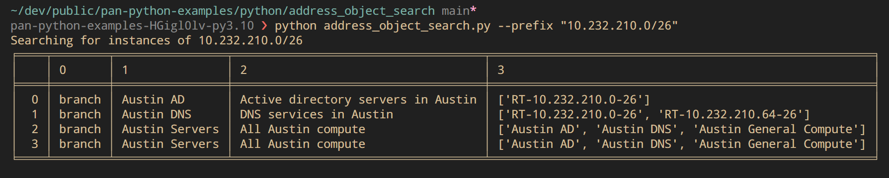
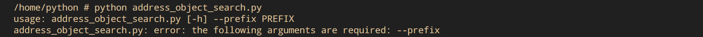
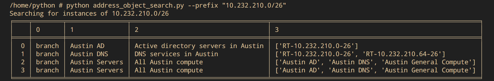

# Search for Address Object references

This script is meant to serve as an educational tool, teaching operators how to work with the pan-os-python Python SDK.

## 🚀 Methods of execution

There are two ways to execute this script:

1. Build a Python virtual environment and execute the script within it.
2. Use the pre-packaged Docker container image.

### 🐍 Build and execute script within a Python virtual environment

Start by cloning this project repository to your local machine and changing into the directory.

```bash
git clone https://github.com/cdot65/pan-python-examples.git
cd pan-python-examples
```

Install Python Poetry to manage our virtual environment, this will allow you to replicate the project's enivornment perfectly.

Follow instructions on [Poetry's documentation page](https://python-poetry.org/docs/), returning here after completed.

Create and activate virtual environment.

```bash
poetry install
poetry shell
```

Change into dictory with our `address_object_search.py` script and rename `.env.example` to `.env`

```bash
cd python/address_object_search
mv .env.example .env
```

Update your credientials in the `.env` file

```ini
PANUSER="your_username_goes_here"
PANPASS="your_password_goes_here"
PANURL="your_panorama_ip_goes_here"
```

Execute

```bash
python address_object_search.py --prefix "1.1.1.1/32"
```

#### Example output



### 🐋 Use pre-packaged Docker container image

We have provided a Docker container to work within; this will not only prevent you from having to worry about maintaing packages within a virtual environment, but it will also provide many features to help you get off the ground faster.

Change into the directory containing the script `address_object_search.py` and rename the `.env.example` file to `.env`

```bash
cd python/address_object_search
mv .env.example .env
```

Update your credientials in the `.env` file

```ini
PANUSER="your_username_goes_here"
PANPASS="your_password_goes_here"
PANURL="your_panorama_ip_goes_here"
```

Pull down the Docker image (one time operation)

```bash
docker pull ghcr.io/cdot65/pan-os-docker:python
```

Start a new container and mount your host's current directory to `/home/python` in the container.

```bash
docker run -it --rm \
    -v "$(pwd)":/home/python \
    -w /home/python/ \
    ghcr.io/cdot65/pan-os-docker:python /bin/sh
```

Execute the script

```bash
python address_object_search.py --prefix "10.30.0.50/32"
```

## Example responses

Execute without passing a prefix argument will fail



Without a match


Single match


Nested matches


